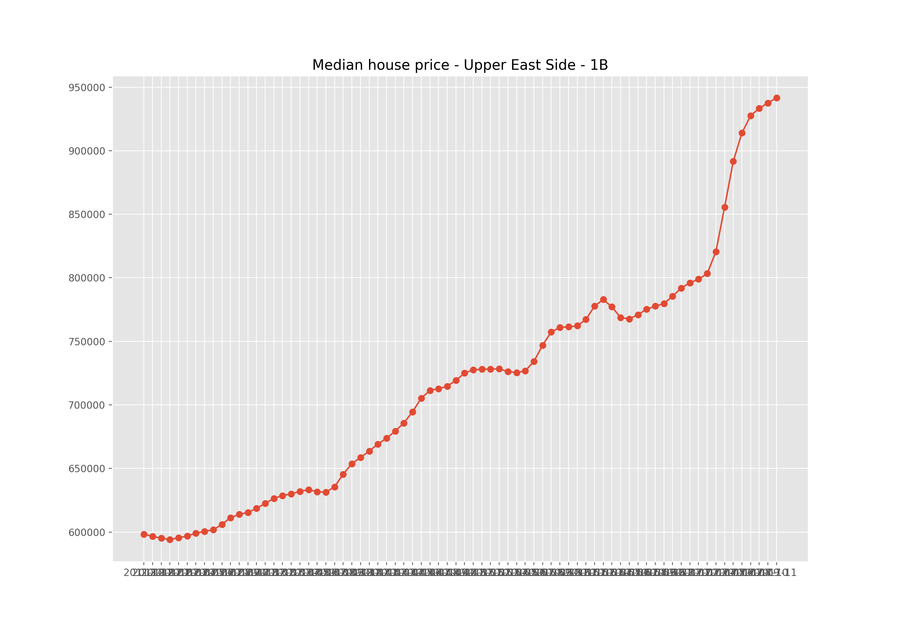

# Time-Series-Housing-Value-and-Rental-Price
ARIMA fitting

## Data Description
* Data is collected from Zillow Research (https://www.zillow.com/research/data/) which
includes median transaction price by neighborhood from 2010 to 2017.

## Median Price Plot

  * Median Rental Rate

  * Median House Value
  

## Time Series Modeling (ARIMA)
